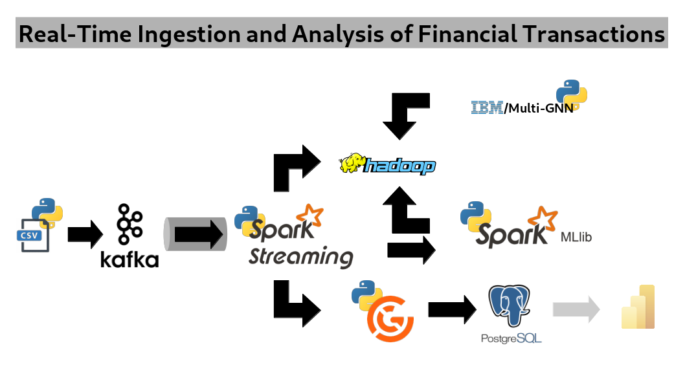

# Real-Time Ingestion and Analysis of Financial Transactions

This project aims to build a comprehensive data pipeline for real-time ingestion and analysis of financial transactions, focusing on expanding knowledge in Kafka, Hadoop, Great Expectations, Spark, and Machine Learning.
The pipeline will ingest data from a Kaggle dataset, process it through a series of technologies, and output the results to a PostgreSQL data warehouse, Hadoop for raw and formatted data storage, and apply machine learning models for money laundering detection.

A roadmap is available [here](ROADMAP.md).

## Overview

### Data Source

- **Kaggle Dataset**: [IBM Transactions for AML](https://www.kaggle.com/datasets/ealtman2019/ibm-transactions-for-anti-money-laundering-aml)
- **Format**: CSV

### Data Feed

- **Kafka**: used for real-time data streaming.

### Data Ingestion

- **Spark**: used for processing and analyzing data in real-time.

### Data Output

- **Hadoop**: used for storing raw and formatted data.
- **PostgreSQL**: serves as data warehouse for storing processed and analyzed data.

### Data Validation

- **Great Expectations**: ensures data quality and integrity through automated testing.

### Machine Learning

- **[IBM/Multi-GNN](https://github.com/IBM/Multi-GNN)**: machine learning models for detecting patterns indicative of money laundering activities.
- **Spark**: playground for all things machine learning.
